# Secure Private Infrastructure Deployment with Bastion Host and IAM Role

## Project Overview:
This project implements a **secure AWS infrastructure** for a fintech company where application servers are completely private. The design ensures that developers never expose servers directly to the public internet and follow least-privilege principles by using IAM roles instead of hardcoded credentials.

---

## Scenario:
Previously, developers were exposing EC2 instances to the internet, violating security standards. The goal is to **redesign the infrastructure** such that:
- Application servers have **no public IPs**  
- Access is **only via Bastion host**  
- EC2 instances use **IAM Roles for AWS resource access**  
- Network routing and isolation are strictly enforced

---

## Objective:
- Launch application servers in private subnets  
- Restrict backend server access to Bastion host only  
- Implement IAM roles with minimal permissions (e.g. S3 read-only)  
- Enforce production-grade security standards  

---
## Architecture Diagram: 
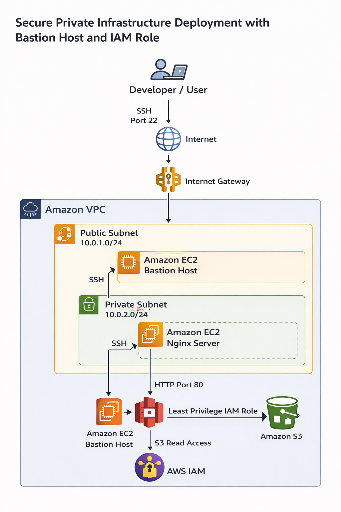

---

## Architecture Design:
**Key Components:**
1. **VPC** – Single VPC with private and public subnets  
2. **Public Subnet** – Contains **Bastion host** with SSH access from your local machine  
3. **Private Subnets** – Contain application EC2 instances (Nginx/Apache)  
4. **Security Groups** – Proper isolation between public and private subnets  
5. **IAM Role** – EC2 instances use IAM role to access S3   

---

## Implementation Steps:
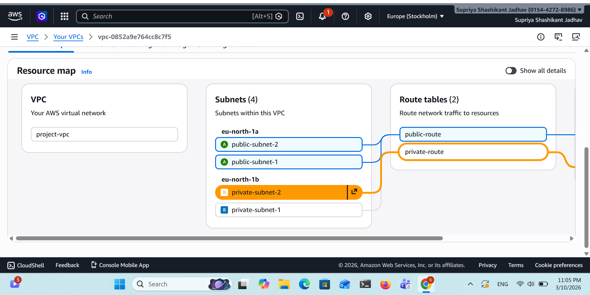

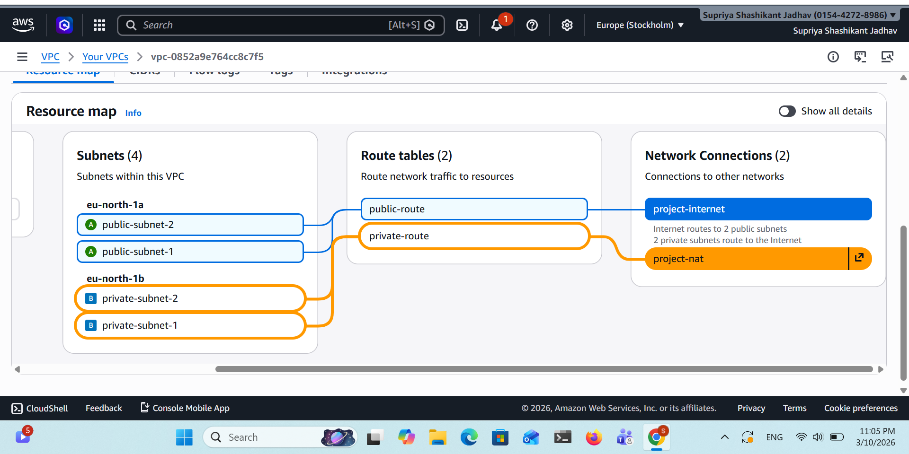

---
### VPC, Subnets, IGW, NAT-Gateway:
1. Create a **VPC** (e.g., 10.0.0.0/16)  
2. Create **public subnet** for Bastion host (10.0.1.0/24)  
3. Create **private subnet** for application servers (10.0.2.0/24)  
4. Configure **route tables**:
   - Public subnet → Internet Gateway  
   - Private subnet → NAT Gateway (for outbound internet access if required)

VPC:
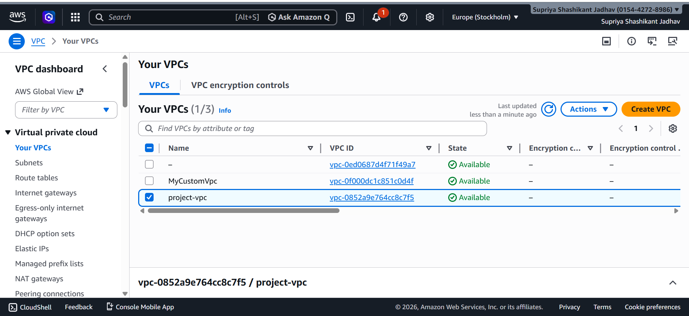

Subnets:
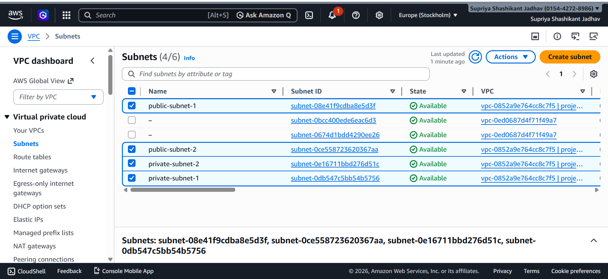

Route Table:
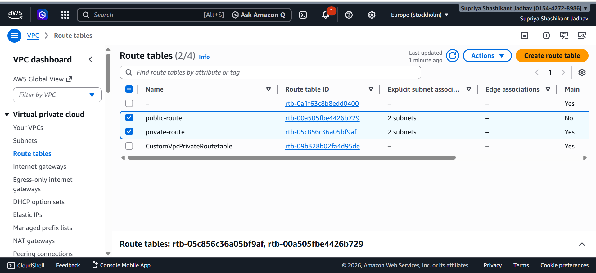

IGW:
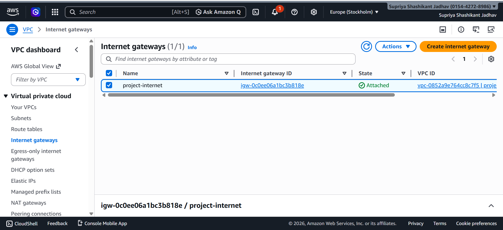

NAT-Gateway:
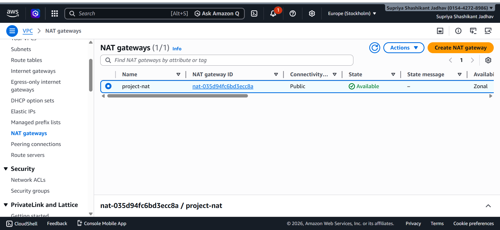

Elastic-IP:
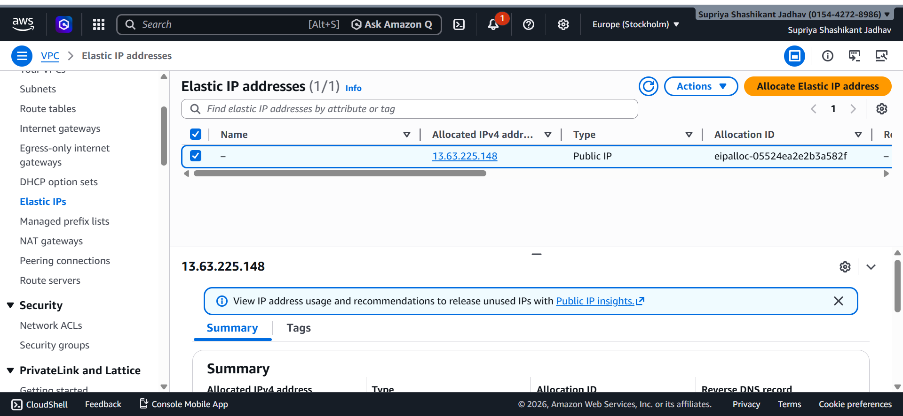

Add IGW Route:
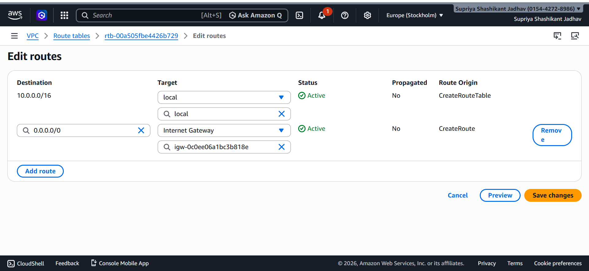

Add NAT-Gateway Route:
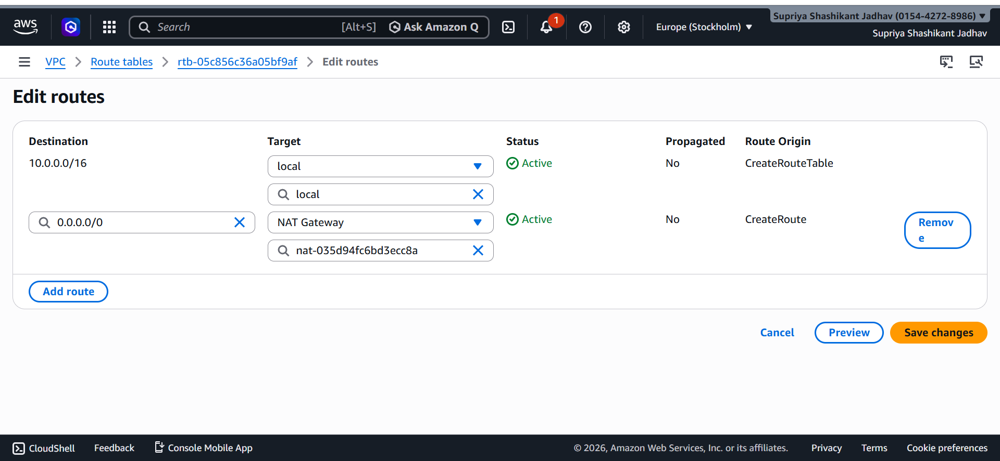

---
### Security Groups
- **Bastion SG:** Allow SSH (port 22) from your IP only  
- **Private EC2 SG:** Allow SSH only from Bastion SG, allow HTTP/HTTPS from internal network  

---
### Bastion Host Setup:
1. Launch EC2 instance in **public subnet**  
2. Assign a **public IP**  
3. Configure security group for SSH from your local machine  
4. Connect from your local machine:
```bash
ssh -i bastion-key.pem ec2-user@<Bastion-Public-IP>
```
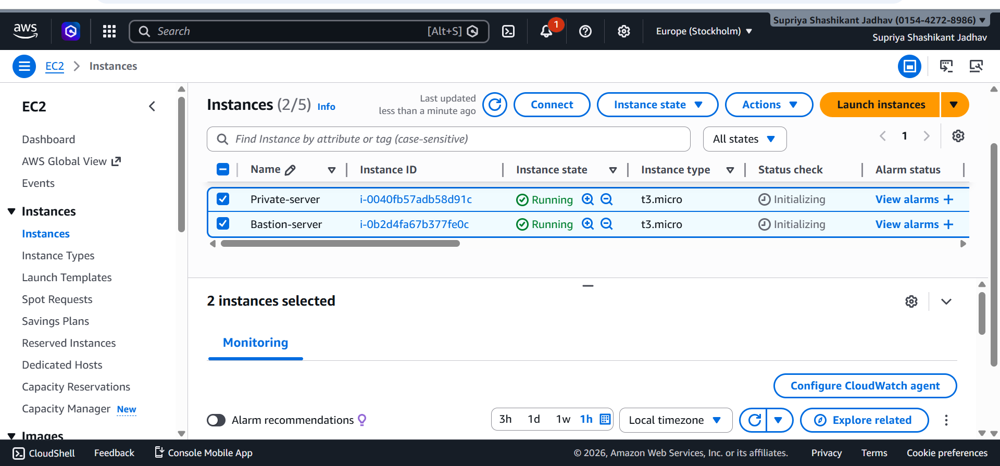

SSH to Bastion:
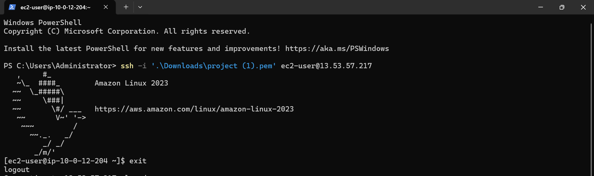

---
### Private EC2 Deployment:

1. Launch EC2 instances in private subnet **(no public IP)**

2. Attach Private-EC2-SG

3. Direct Connect to Private EC2
- **I don't have Public IP** so I can't Access **Directly**

Error:
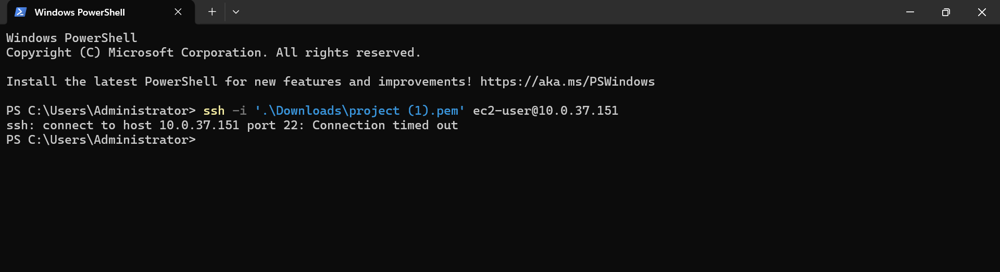

4. Connect via Bastion Host:
```
scp -i ./Downloads/Bastion-key.pem ./Downloads/app-key.pem ec2-user@<Bastion-public-IP>:.
```
```
ssh -i bastion-key.pem ec2-user@<Bastion-Public-IP>
```
SCP & SSH to Bastion:
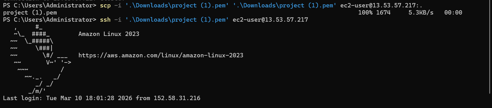
```
sudo chmod 400 app-key.pem
```
Run Command on Bastion Host:
```
ssh -i app-key.pem ec2-user@<application-Private-IP>
```
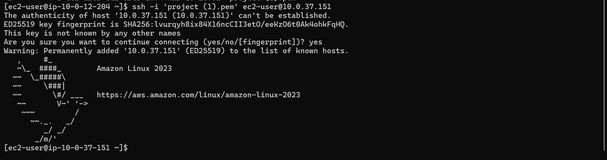

---
### Application Deployment:

1. Install Nginx or Apache on private EC2:
```
sudo yum update -y
sudo yum install nginx -y
sudo systemctl start nginx
sudo systemctl enable nginx
```
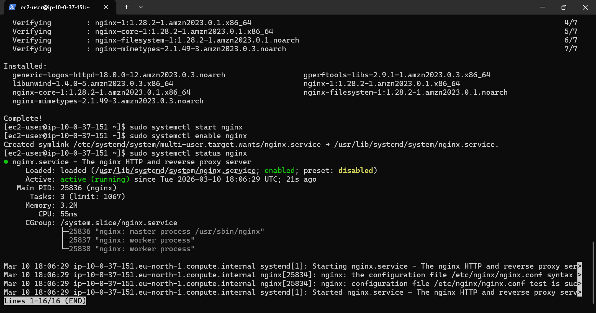

2. Deploy a sample web page (index.html) in:
``` 
/usr/share/nginx/html/
```
index.html:
```
<h1> Welcome to My AWS Project </h1>
<p> Nginx Running on Private EC2</p>
```
3. Output:
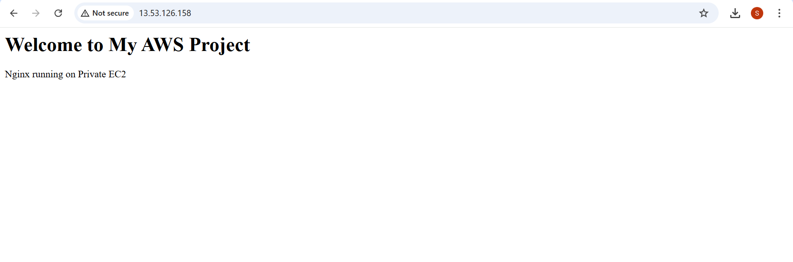

---
### IAM Role Creation & Attachment:

1. Create IAM role **(EC2S3ReadOnlyRole)**
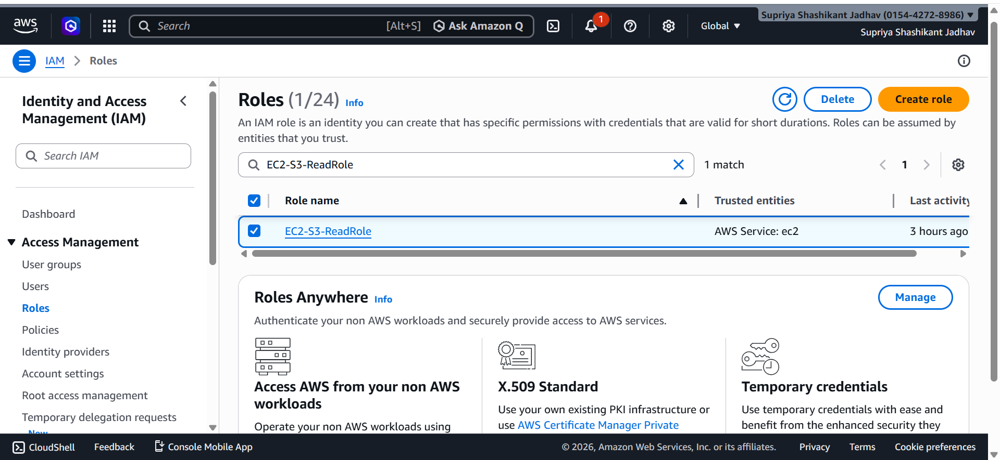

2. Attach **AmazonS3ReadOnlyAccess** policy
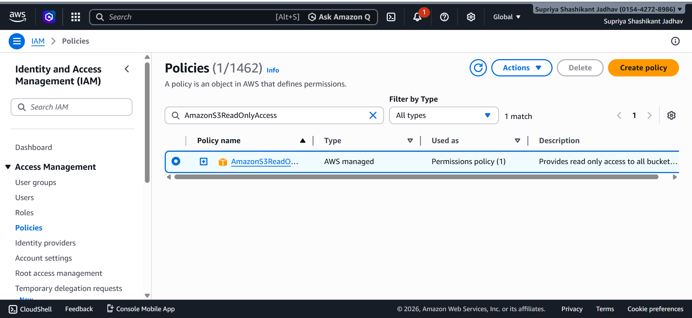

3. Attach the role to your private EC2 instance
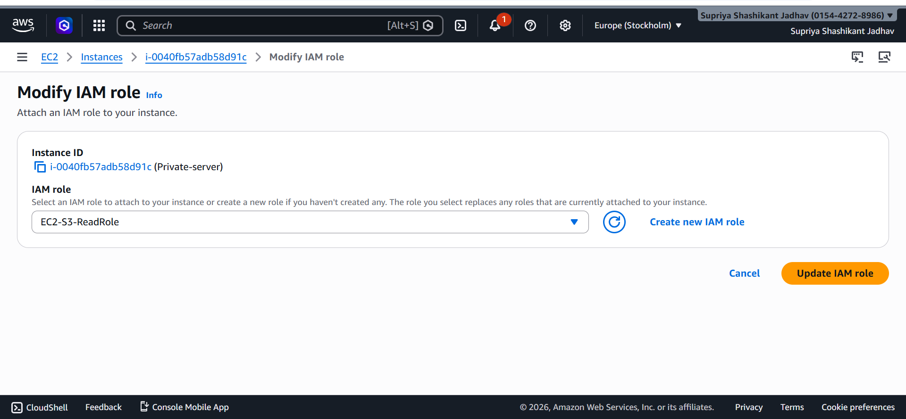

4. Verify access from EC2 instance:
```
aws s3 ls 
```
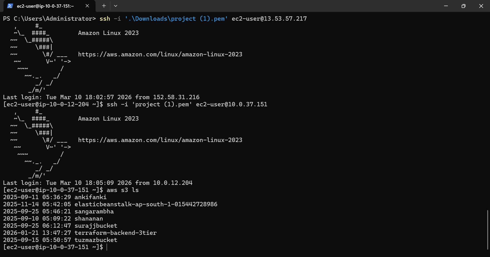

---
## Conclusion:

This project demonstrates a secure AWS infrastructure by deploying application servers in private subnets and restricting access through a Bastion Host. It follows best practices like least-privilege access using IAM roles and proper network isolation using VPC components. Overall, the architecture ensures enhanced security, controlled access, and a production-ready cloud environment.

---
### Author: Supriya Jadhav
---